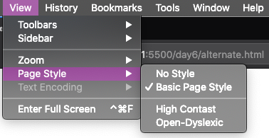

Chapter two is dedicated to the `link` element, its various attributes and use cases. Broadly speaking the `link` element is used to "link" other document or resources. I used quotes around the word link because you may know the element primarily for linking stylesheets to a document, but there is a **lot** more that can be done with this element. We will start with the more well-known attributes and uses and then move on to the newer and lesser known attributes.

## The `href` attribute

The `href` attribute is the core of this element. It is required, if no `imagesrcset` is present, and needs to contain a valid Uniform Resource Locator (URL). As mentioned before, the most commonly known use case is linking an external stylesheet, for example:

```html
<link href="style/main.css" />
```

## The `media` element

In the past this attribute was primarily used to link separate stylesheets for defining the style rules for rendering the document on a screen or when printing. For example:

```html
<link rel="stylesheet" href="screen.css" media="screen" />
<link rel="stylesheet" href="print.css" media="print" />
```

Since media queries was added to CSS it is also common to use the `@media print` media query in your stylesheet to specify custom styling for printed output. There is a benefit to separating these rules into a separate stylesheet and link it with a print media attribute as shown above. The benefit of doing it this way is because, when viewing the document on a display, the browser will mark the print stylesheet as low-priority and defer downloading and parsing the stylesheet until other resources meant for the screen have been downloaded and parsed.

When the browser does download the print stylesheet it will do so in a non-blocking manner because it knows that the stylesheet is not needed for rendering the document on the screen. This can lead to performance improvements as the browser can focus on downloading, parsing, and applying only that which is needed for rendering the document on screen.

> **Side note:** What is render blocking? When the browser encounters a CSS file it will stop parsing the HTML document and download the CSS file. Once the CSS file has been downloaded the browser will parse the CSS file and apply the styles to the HTML document. This process is render blocking as it prevents the rest of the document from rendering until the CSS file has been downloaded and parsed.

Besides the commonly known values `all`, `screen`, and `print` (there are also around [8 more, but those have been deprecated](https://drafts.csswg.org/mediaqueries/#media-types)), the `media` attribute supports any valid media query! This means you can specify that a stylesheet is only needed for a specific screen size such as a tablet. For example:

```html
<link
  rel="stylesheet"
  href="tablet.css"
  media="screen and (max-width:63.9385rem)"
/>
```

> **Note:** The value 63.9385rem (63.9385 \* 16) is equivalent to 1023px which is roughly the width of a tablet in landscape mode.

An important aspect to note here is the use of a `max-width` media query. If you are used to following a mobile-first approach when implementing your front-end, you probably make use of `min-width` media queries. If you used `min-width` in this instance though you will get unexpected results, for example:

```html
<link rel="stylesheet" href="base.css" media="screen" />
<link
  rel="stylesheet"
  href="tablet.css"
  media="screen and (min-width:63.9385em)"
/>
<link
  rel="stylesheet"
  href="mobile.css"
  media="screen and (min-width:47.9385em)"
/>
```

What you will notice with the above is that even on desktop viewport sizes the mobile stylesheet will be applied This is because all three media queries match the environment. The other surprising result you will encounter is that on mobile viewport sizes, only `base.css` is applied.

Using `max-width` will resolve the problem and apply the relevant, and _only_ the relevant, stylesheet for the matched media query. As such, this is not a candidate for a mobile-first implementation strategy as the stylesheets are not applied in an additive manner i.e. apply mobile on mobile, mobile _and_ tablet on tablet, etc.

This can be useful in cases where you have CSS that is only ever applicable to a specific viewport. In so doing you free up your browser to focus on downloading and parsing CSS that is relevant for the immediate environment which could lead to additional performance gains.

## The `rel` attribute

The `rel` attribute indicates the **rel**ationship between the current document and the file or document being referenced by the `href` attribute. The `rel` attribute is required and should contain one, or more, valid keywords in order for a link to be created.

What does this mean? If you have the following HTML document, for example:

```html
<!DOCTYPE html>
<html lang="en">
  <head>
    <title>Styled Heading</title>
    <link href="style/main.css" media="screen" />
  </head>
  <body>
    <h1>I am Red!!</h1>
  </body>
</html>
```

In `main.css` you have the following style rule:

```css
h1 {
  color: red;
}
```

Loading the document in your browser will show the heading but, the color will be black. Because the `rel` attribute is not present, the browser creates no link and thus, does not load the CSS file. If you were to add a `rel` attribute, but set its value to say, "await", it would produce the same result. That is because the value "await" is not a valid keyword.

In order for the link to be created and for the stylesheet to be loaded, you need to specify a valid value such as `stylesheet`:

```html
<link rel="stylesheet" href="style/main.css" media="screen" />
```

Reloading the document will now show the heading as red.

### A use case for invalid values

The latter of the two "incorrect usages" above is a strategy often used to lazy load CSS files that are not critical on the initial load. The crux of it is as follows. You add a `link` element to the head of the document but, set the value of the `rel` attribute to an invalid keyword, say, "await". As you saw earlier, this will result in the browser not loading the CSS file.

At the end of the HTML document, you would then have some JavaScript that swaps out the invalid keyword for a valid keyword:

```javascript
(function () {
  "use strict";

  // find the stylesheet to be lazy loaded
  const lazyStylesheet = document.querySelector("[rel='await']");
  lazyStylesheet.setAttribute("rel", "stylesheet");
})();
```

Once the above JavaScript executes (generally when the DOM(document) has finished loading), the browser will detect the change, recognize the `rel` attribute, load, parse and apply the CSS. This is a simple way to lazy load CSS files that are not critical to the initial rendering of the document.

## The `alternate` keyword

The `alternate` keyword of the `rel` attribute suggests that it creates a link to an alternative version of the current document. While that is true, there are some important details. The meaning of the keyword depends on the other attributes used along with it or, the keyword combination.

Let's discuss keyword combinations. With regard to accessibility, there are a lot of things to take into account when designing and developing for the web. Color contrast, as well as the size and type of font used, are some of these considerations. Sometimes though, it is hard or even impossible to address everyone’s needs in the base styling of your website. But this does not mean that all hope is lost. One way to offer a customizable experience to everyone is through the use of alternate stylesheets.

Let's look at an example.

```html
<link rel="stylesheet" href="style/main.css" media="screen" />
<link
  rel="alternate stylesheet"
  href="style/high-contrast.css"
  media="screen"
/>
<link rel="alternate stylesheet" href="style/dyslexia.css" media="screen" />
```

As you can see above, we are linking three stylesheets here. One that is the main stylesheet of our website and two alternative stylesheets. The content of these could be something like:

```css
/* main.css */
body {
  background-color: #fff;
  color: #212121;
  font: 100%/1.5 sans-serif;
}

/* high-contrast.css */
body {
  background-color: #212121;
  color: #fff;
}

/* dyslexia.css */
body {
  font-family: OpenDyslexic;
}
```

Loading the document in a browser will show our content styled as defined in `main.css`. Those other two stylesheets are available to our users though not immediately obvious. In Firefox click on the `View` menu and then hover over `Page Style`.

But wait, where is our alternate stylesheets?

For them to be shown, there is one final piece of the puzzle that need to be added. The `title` attribute.

```html
<link rel="stylesheet" href="style/main.css" media="screen" />
<link
  rel="alternate stylesheet"
  href="style/high-contrast.css"
  media="screen"
  title="High Contrast"
/>
<link
  rel="alternate stylesheet"
  href="style/dyslexia.css"
  media="screen"
  title="OpenDyslexic"
/>
```

With the `title` attribute set, the purpose of our alternate stylesheets is clearly defined. Reloading the document in the browser and clicking on `View > Page Style` will surface our alternatives in the UI.



A couple of things to note here. All three stylesheets will be loaded by the browser but, the alternate stylesheets will be given the lowest priority and will be loaded in a non-blocking manner. The second thing is that the stylesheets are not loaded in an additive manner i.e. each stylesheet is loaded by itself. This is unfortunate and makes the use case of these alternate stylesheets via the native client almost useless except for some rare cases such as a super stripped-down version of the site (something akin to a reader mode).

With that said, using a similar technique to the one shown for lazy loading CSS, you could build a simple UI for your website and additively load these stylesheets when the user selects an alternate version. I am not going to dig into the details here but, it would be something useful to provide to end-users.

### When `alternate` is combined with `hreflang`

As mentioned earlier, the meaning of `alternate` changes depending on the keyword it is paired with as well as other attributes used. The `hreflang` attribute is one of those that affect the meaning of `alternate`. As the name suggests, this attribute defines an alternate language for the current page. For example, assuming our current page is in English:

```html
<link
  rel="alternate"
  href="/fr/document.html"
  hreflang="fr"
  title="French version"
/>
```

The above is used by search engines to determine whether there is an alternate version of the document available in the user’s preferred language and, it prevents the problem of [duplicate content](https://yoast.com/duplicate-content/) that can lead to negative outcomes for your site with regard to search engine optimization (SEO).

### The `canonical` keyword `[NON-STANDARD]`

While we are talking about alternate versions of the same page, it is an opportune time to quickly discuss another keyword of the `rel` attribute. When specifying an alternate version of the current document, it is also very important to indicate that the current document is the canonical(recognized, authoritative, authorized, accepted) version of this document. For example:

```html
<link rel="canonical" href="https://www.example.com/" />
<link
  rel="alternate"
  href="/fr/document.html"
  hreflang="fr"
  title="French version"
/>
```

However, this is used for the benefit of search engines and to avoid the duplicate content problem mentioned before. According to the HTML standard, `canonical` is not a valid keyword of the `rel` attribute. It is mentioned here because search engine ranking plays such a major part in how your content is found on the web.

> **Note:** This is also often used when cross-posting content from your own blog to sites such as Dev.to. This tells the search engine that the canonical (origin or source of truth) is located on your blog and that this is not simply duplicate content.

### When used with the `type` attribute

Using `alternate` with the `type` attribute is a means of specifying an alternate type or variant of the current document. A common use case is to point to a syndication feed such as a really simple syndication (RSS) feed:

```html
<link
  rel="alternate"
  type="application/atom+xml"
  href="rss.xml"
  title="All the posts!"
/>
```

There are many tools and browser extensions that will surface this information to users and make it easy for them to subscribe to the feed of a blog or website. You can also use `type` and `hreflang` together with `alternate`. For example:

```html
<link
  rel="alternate"
  href="/en/monkey-habits.pdf"
  hreflang="en"
  type="application/pdf"
  title="Download the English PDF version"
/>
<link
  rel="alternate"
  href="/fr/monkey-habits.pdf"
  hreflang="fr"
  type="application/pdf"
  title="Téléchargez la version PDF française"
/>
```

## The `icon` keyword

Before we look at the syntax, let’s discuss what is meant by icon here. If you have heard of the term favicon, this is the icon it is referring to. You may also have encountered an error being logged in the developer console to the effect, `GET http://127.0.0.1:5500/favicon.ico 404 (Not Found)`

What is this icon the browser is looking for? Well, the icon in question is the one commonly seen in a browser tab for the website you are currently visiting:


And the reason for the error? First, the file does not exist. But then you probably have not even specified the file anywhere in your code, so why is the browser even attempting to load it? This is down to the loading algorithm browsers use when it attempts to find a favicon to use for your website.

If you see are seeing the error above, then based on this algorithm I can make some assumptions.

1. You do not have a `link` element in the `head` of your document with a `rel` attribute using the `icon` keyword.
2. You do, but the resource pointed to by the `href` attribute does not exist.
3. You do not have a file with the name `favicon.ico` at the root of your website.

I can make those assumptions in order because that is what the browser will do when attempting to find and load a favicon for your website. In other words, the browser will look for a link element with a `rel` attribute using the keyword `icon`. Should it find one, it will attempt to load the resource specified by the `href` attribute. Should the format of the resource not be supported or, the resource fails to load, the browser will attempt to fetch the favicon from `www.yoursite.com/favicon.ico`. Failing that, it will give up and "silently" fail. I put silently in quotes, because, unless you are a developer poking around in developer tools, you will be none the wiser that all the above even happened, or that it resulted in an HTTP 404 error.

Knowing the above, we can take the needed steps to avoid the unhappy outcome we saw above. But wait, if the browser will in the end just look for that file at the root of your website, why not just put the relevant file there and be done with it? That is an option, and you would not be wrong for doing it however, why make the poor browser jump through all those hoops if we can just tell it where to find the file we want it to use in a single line of code?

There are more reasons to use the `link` element with the `icon` keyword than just to avoid the browser's favicon loading algorithm. Even though the `ico` format has served us well in the past, the web has moved on. The `ico` format was originally conceived of by Microsoft back in the early days of the web as a format that can contain multiple, differently sized versions of the same file. The browser or operating system will then decide which size to use based on the context it is used in, and the screen resolution.

The `ico` format is mostly deprecated and is not used anywhere else on the web platform. We have more file format options, the array of screen resolutions have exploded, the icon is used for more than just tabs, and we have dark mode to contend with. In short the web has evolved and the humble favicon with it.

### `icon`

As with most(all?) things browser-related, it is very forgiving and will do its utmost to make up for things it does not understand(aka support), or mistakes we as web developers make. Case in point, when a browser encounters a tag, attribute, or value of an attribute it does not understand, it does not just give up and break down, but keeps going, trying to find a way it can get as close to what the developer intended. Failing all else, it will eventually give up and fail silently. Presenting the user with the best possible interpretation of what it could understand. Aren't browsers magical?

With this in mind, we start from the most modern approach for defining a favicon and work our way backward to ensure backward compatibility.

### The Scalable Vector Graphics (SVG) format

The easiest way to support the vast array of screen resolutions out there is to use an image format that is scalable. On the web, that image format is SVG aka Scalable Vector Graphics. Support for SVG icons is pretty new but, [browser support is pretty good](https://caniuse.com/#feat=link-icon-svg) already. As some folks have discovered, over and above supporting various resolutions, because one can embed CSS inside an SVG, you can even [support dark mode with a single SVG icon](https://blog.tomayac.com/2019/09/21/prefers-color-scheme-in-svg-favicons-for-dark-mode-icons/).

The first icon we will add to our head is an SVG icon:

```html
<link rel="icon" href="favicon.svg" sizes="all" type="image/svg+xml" />
```

You will notice a new attribute in the above snippet, the `sizes` attribute. This is what allows us to define and specify different sized icons used for different resolutions when using for example the Portable Network Graphics (PNG) image format. Because an SVG can scale up or down infinitely, we use the special keyword, `all`.

### The Portable Network Graphics (PNG) format

Should the browser not support SVG icons, it will ignore our line above and look at the next line of code. The next format in line with a [much wider level of browser support](https://caniuse.com/#feat=link-icon-png) is the PNG image format. Because PNG images are [raster-based](https://developer.mozilla.org/en-US/docs/Glossary/Raster_image) and not [vector based](https://www.adobe.com/africa/creativecloud/design/discover/vector-file.html), we do need to specify (and have on disk) a couple of different sizes:

```html
<link rel="icon" href="/favicon-32x32.png" sizes="32x32" type="image/png" />
<link rel="icon" href="/favicon-16x16.png" sizes="16x16" type="image/png" />
```

That covers what is defined in the HTML standard. Unfortunately, there is one more thing we do need. The non-standard apple-touch-icon keyword for rel.

### The `apple-touch-icon` keyword `[NON-STANDARD]`

Even though this is not a standard, [HTML validators will not error](https://github.com/validator/validator/issues/433#issuecomment-268984140) when present, but [Lighthouse will error if it is not present](https://web.dev/apple-touch-icon/). Other platforms also depend on it as it is so [well known and widely used](https://github.com/h5bp/html5-boilerplate/blob/master/src/index.html#L16) so, it is best to include it as well. Thankfully there is no proprietary file format, just the non-standard keyword and some specific sizes:

```html
<link
  rel="apple-touch-icon"
  href="apple-icon-144x144.png"
  sizes="144x144"
  type="image/png"
/>
<link
  rel="apple-touch-icon"
  href="/media/apple-icon-152x152.png"
  sizes="152x152"
  type="image/png"
/>
<link
  rel="apple-touch-icon"
  href="/media/apple-icon-180x180.png"
  sizes="180x180"
  type="image/png"
/>
```

> **NOTE:** You may not need all the sizes specified above. The sizes are based on the [Apple Safari Web Content Configuration](https://developer.apple.com/library/archive/documentation/AppleApplications/Reference/SafariWebContent/ConfiguringWebApplications/ConfiguringWebApplications.html) documentation.

What about `rel="shortcut icon"`? This is another relic of the past, is not defined in the HTML standard, and would only be used to specify the `ico` variant. Beyond that, even specifying the type when using a `ico` is [up for debate](https://stackoverflow.com/questions/13827325/correct-mime-type-for-favicon-ico) and contentious. If you want the widest possible browser support, ensure that you have a `favicon.ico` at the root of your website.

> **NOTE:** You do not have to create all the needed files yourself. You can use a tool such as [The Real Favicon Generator](https://realfavicongenerator.net/) to create all the needed files for you. You can then download the zip file and extract it to the root of your website.

## Resource Hints

The next set of keywords are all about performance and through performance, improving user experience and accessibility. Before we dig into the various [resource hints](https://w3c.github.io/resource-hints/) I want to be clear that this will by no means be a deep dive into resource hints. That is a topic all its own. In this chapter, we will get to know the various resource hints as well as go over the basics of what they are used for.

> **Note:** As the name suggests, these are hints we as developers provide to the browser so, for the most part, it is still up to the browser to decide whether to follow our hints or not.

In the related reading section I will provide some resources should you wish to explore this topic further.

### 🐢 The `dns-prefetch` keyword

DNS, or **D**omain **N**ame **S**ervice along with the **I**nternet **P**rotocol (IP) is the core addressing system used to connect you to the website you wish to visit. The size of the internet is immense and dynamic with new IP addresses and domain names constantly being added.

Your browser needs to know the IP address of the domain name you typed into the address bar in order to connect to it. Because of the vastness of the internet, it is therefore not always a quick and simple process for your browser to get hold of this IP address. DNS is made up of an array of DNS zones and servers strewn across the globe. The closest one to you might not be the one that has the address and related IP address in its database. So, the [first DNS server may need to ask a second and a third](https://nlp.stanford.edu/IR-book/html/htmledition/dns-resolution-1.html) before getting hold of the IP address it needs to send back to the browser. Commonly a DNS lookup [takes between 20 - 120 milliseconds](https://www.keycdn.com/support/reduce-dns-lookups).

It is also very common these days for a single webpage to connect to multiple domain names in order to get external resources such as custom fonts, JavaScript libraries, etc. For each new domain the browser encounters, it needs to do an initial DNS lookup request. You can see how this can potentially add up.

> **NOTE:** Do take the time to read the following post: [Say goodbye to resource-caching across sites and domains](https://www.stefanjudis.com/notes/say-goodbye-to-resource-caching-across-sites-and-domains/)

This is then where `dns-prefetch` comes into play. If we know for example that we will be getting a JavaScript library from say [unpkg](https://unpkg.com/), we can get some leg work out of the way by telling the browser about the domain name, and asking it to pretty please do the DNS resolution/lookup as early as possible.

Using the UNPKG example domain above, we will add the following to our `head`:

```html
<link rel="dns-prefetch" href="https://unpkg.com/" />
```

### 🐭 The `preconnect` keyword

There is more to connecting to another server than just DNS though. DNS maintains a map of domain names to IP addresses and so, it can tell the browser the IP address at which the destination server exists but, that is where it ends. The next step is for the browser to initiate a connection to the IP address.

The first step in this process is what is known as the Transmission Control Protocol (TCP) handshake. This is the process whereby the [client (browser) negotiates a connection with the server](https://www.youtube.com/watch?v=xMtP5ZB3wSk). Essentially, the client sends a request to the server saying, "Hey, can you please open a connection for me?". The server then responds with, "Hi there! Sure, could you also open one for me on your end?". To which the client responds, "Yup, done". A two-way connection now exists between the client and the server.

If you are connecting to the other server via HyperText Transfer Protocol Secure (HTTPS), which is very common and almost universal these days, there is an additional handshake that needs to happen after the TCP handshake completes. This is known as the [Transport Layer Security (TLS)](https://en.wikipedia.org/wiki/Transport_Layer_Security) handshake.

The process goes something like this. The client sends a "hello" message to the server. This time, it includes the TLS version and cipher suites it supports, as well as a string of random bytes (aka "client random"). The server responds with a "hello" which includes its [SSL certificate](https://www.cloudflare.com/learning/ssl/what-is-an-ssl-certificate/), its chosen cipher suite, and the "server random". The browser verifies the SSL certificate and if verified, sends back one more strings of random bytes knows as the "premaster secret". The server decrypts the "premaster secret". Both client and server generate session keys from the client random, server random, and premaster secret. The client sends an encrypted "finish" message, the server replies with an encrypted "finish" message, the handshake completes and the connection continues using the session keys.

That is a lot! Thankfully this entire process takes only milliseconds, but it does add to the overall latency of getting the data your application needs and your user is interested in. Using `preconnect`, we are asking the browser to take all the above steps, including DNS lookup, as early as possible for the domain we specify. So, if that library you need to get from UNPKG is supercritical, and you want to reduce as much of the latency as possible, as early as possible, you want to reach for `preconnect` as opposed to just `dns-prefetch`. Let's change the above example to do a `preconnect`:

```html
<link rel="preconnect" href="https://unpkg.com/" />
```

## The `crossorigin` attribute

Before we move on to the next keyword, I want to quickly touch on the `crossorigin` attribute. This attribute is used, as the name suggests, when linking to cross-origin assets. More specifically, when `preloading` assets cross-origin. For example, on the domain `example.com` you may want to preload some JavaScript from `widgets.com`

```html
<link rel="preload" href="https://widgets.com/widget/tabs.js" />
```

The above request will be blocked by the browser and as a result, fail to load. If you have [**C**ross-**O**rigin **R**esource **S**haring (CORS)](https://developer.mozilla.org/en-US/docs/Web/HTTP/CORS) correctly setup, you can resolve the problem by using the `crossorigin` attribute, for example:

``` html
<link rel="preload" href="https://widgets.com/widget/tabs.js" crossorigin />
```

The above will initiate an anonymous cross-origin fetch. In other words, it will not pass along any credentials such as a cookie, or HTTP basic authentication. Depending on the requirements of your CORS set up the above might be sufficient. If however, your endpoint does require credentials, you can specify this as follows:

```html
<link
  rel="preload"
  href="https://widgets.com/widget/tabs.js"
  crossorigin="use-credentials"
/>
```

> **An important side note:** While we are talking about preloading and cross-origin though, there is a little gotcha to be aware of with regard to preloading fonts. When preloading fonts, you always have to specify the `crossorigin` attribute whether the font is being loaded cross-origin or not. This is because of the [font fetching requirements](https://drafts.csswg.org/css-fonts/#font-fetching-requirements) as defined in the CSS font specification.

With that, we can get back to the remaining resource hints.

### 🦅 The `prefetch` keyword

While the above is mainly concerned with the current page, `prefetch` and its close cousin `prerender` is concerned with resources used on the next navigation. The `prefetch` resource hint informs the browser of a resource that is highly likely to be required on future navigation and as such, it would be beneficial to preemptively [fetch](https://fetch.spec.whatwg.org/#concept-fetch) and cache the resource.

> **Note:** While the browser might fetch and cache the resource, it will not process, parse or execute.

There are two optional attributes that can be used in combination with `prefetch`. These are [`as`](https://developer.mozilla.org/en-US/docs/Web/HTML/Element/link#attr-as) and `crossorigin`. We have covered `crossorigin` before and its use in this context is the same. While the `as` attribute is optional, it is useful in order to indicate the type of resource that will be prefetched. This allows the browser to optimize the fetching process by setting appropriate request headers, transport priority, etc.

Let’s look at prefetching a JavaScript resource for example:

```html
<link
  rel="prefetch"
  as="script"
  crossorigin="anonymous"
  href="https://unpkg.com/three"
/>
```

### 🐕 The `prerender` keyword

The next step up from `prefetch` is `prerender`. The first notable difference is that the browser will not only fetch the resource but, it will also execute it. But, `prerender` is only used for HTML documents. If you need to fetch a different type of resource, `prefetch` is your tool of choice. As such, the `as` and `crossorigin` attributes are not valid in this context.

> **NOTE:** What the browser does with regard to sub-resources (images, scripts, style, etc.) is implementation and context dependent.

```html
<link rel="prerender" href="https://example.com/search-results.html" />
```

### 🐈 The `preload` keyword

There is one more keyword that is related to the above resource hints. The `preload` keyword is different from the above in that it is not a hint, but an instruction to the browser to preload and cache the resource i.e. whereas the hints state that the browser _should_ pretty please with sugar on top take the action, `preload` indicates that the browser must take the action.

The syntax of `preload` is the same as that of `prefetch`:

```html
<link
  rel="preload"
  href="https://unpkg.com/three"
  as="script"
  crossorigin="credentials"
/>
```

As with `prefetch` the browser will fetch and cache the resource but not execute. Preload is also only concerned with the current page. It is not to be used for resources that might be required later during subsequent navigation.

> NOTE: While the resource hints are well-supported across modern browsers, `preload` [has some caveats](https://developer.mozilla.org/en-US/docs/Web/HTML/Link_types/preload#browser_compatibility).

## The `modulepreload` keyword

The `modulepreload` keyword is a specialized form of preload all about optimizing [ES module](https://developer.mozilla.org/en-US/docs/Web/JavaScript/Guide/Modules) loading. As such, the only valid type you can load with `modulepreload` is JavaScript with the `as` attribute being set to `script` by default. Discussing ES modules is way beyond the scope of the book, but I can highly recommend the [JavaScript Definitive Guide](https://www.oreilly.com/library/view/javascript-the-definitive/9781491952016/) or [MDN Web Docs](https://developer.mozilla.org/en-US/docs/Web/JavaScript/Guide/Modules) and the resources in the related reading section for more info.

There are two ways you can approach using `modulepreload`. The specification calls out the fact that, because module scripts declare their dependencies, implementation can take advantage of this fact to preload all the declared dependencies of a module. For example, say we have a module script called `main.mjs`. This script then declares the following dependencies: `utils.mjs`, `parser.mjs`, `animation.mjs`. Now, assuming we have the following in the head of our document:

```html
<link rel="modulepreload" href="main.mjs" />
```

The implementation could introspect this module and discover the declared dependencies. With this knowledge the implementation (JavaScript engine) could then go ahead and fetch and cache all the dependencies as well, setting everything up for a much speedier experience once the main module is parsed and executed.

As the above is implementation-dependent, a safer option would be to be explicit as follows:

```html
<link rel="modulepreload" href="main.mjs" />
<link rel="modulepreload" href="utils.mjs" />
<link rel="modulepreload" href="parser.mjs" />
<link rel="modulepreload" href="animation.mjs" />
```

Now, if the implementation does take advantage of the fact the module dependencies are declared, it would run an algorithm that goes something like this:

- I see you have a module called `main.mjs` you want me to preload, let me get that for you...
- OK, I got it 👍. Let me stick that in my module map 🗺
- Oh wait, I see this module declares some dependencies. Let me grab those as well.
- OK, I got it 👍. Let me stick those in my module map as well 🗺
- Ah, I see you have another module called `utils.mjs` you want me to preload, let me get that for you...
- Wait, wait... I think I already have that module in my module map. One sec... ⏲
- Yup, yup, I already have that one
- Ah, I see you have another module called `parser.mjs` you want me to preload, let me get that for you...
- Wait, wait... I think I already have that module in my module map. One sec... ⏲
- Yup, yup, I already have that one
- etc.

If however, the JavaScript runtime implementation does not do the above, it will simply step through each link element and fetch and cache each module in turn.

## The `next` keyword

So, you remember how we talked about the various types of resource hints? Well, the `next` keyword of the `rel` attribute is a kind of shortcut for those. In particular though, as the name suggests, a document resource that relates to the next navigation context.

With `next` you essentially give up control and tell the browser, "This document here, this is where the user will go next, you do what you think is best". The implementation can then decide to only do a `dns-prefetch` or a full `prerender` of the resource.

```html
<link rel="next" href="https://example.com/next-step.html" />
```

> While not currently in the list of [supported tokens](https://html.spec.whatwg.org/#attr-link-rel) there is also a `prev` keyword (aliased to previous), that indicates the logical previous document in the sequence.

## The `pingback` keyword

If you have spent some time reading blog posts on the internet you have probably seen this section called "pingbacks" at the end of a post. The idea behind a pingback is to create a method by which an author can request to be notified when somebody links to one of their documents. This is in fact an entire specification all by itself, and as such, I will not cover the details here but, you will find a link to the full specification in the related reading section.

The syntax for a `pingback` is as follows:

```html
<link rel="pingback" href="https://example.com/xml-rpc" />
```

There may only be one `pingback` per document and the `href` attribute must contain a valid absolute URL.

## The `search` keyword

The `search` keyword allows you to create a link to a document that provides search functionality for the current document and related resources aka. A dedicated search page for your website:

```html
<link rel="search" href="https://example.com/search" />
```

OpenSearch is a specification currently in draft form that can be used in conjunction with the `search` token to enable auto-discovery of search interfaces. When used in this way, there are a couple of additional attributes that need to be added. Here, for example, is the `link` element from DuckDuckGo:

```html
<link
  title="DuckDuckGo"
  type="application/opensearchdescription+xml"
  rel="search"
  href="https://duckduckgo.com/opensearch.xml?atb=v223-5__"
/>
```

While DuckDuckGo does not have it set, the [specification also calls for a `profile` attribute](https://github.com/dewitt/opensearch/blob/master/opensearch-1-1-draft-6.md#autodiscovery-in-htmlxhtml) that needs to be set on the head element as follows:

```html
<head profile="http://a9.com/-/spec/opensearch/1.1/">
  ...
</head>
```

This concludes chapter two, but we are not done with the `link` element. We still need to cover the integrity attribute, `type`, `referrerpolicy`, `imagesrcset`, and `imagesizes`. All of these will be covered in chapter three.

## Related Reading

- [CORS on MDN Web Docs](https://developer.mozilla.org/en-US/docs/Web/HTTP/CORS)
- [Media Queries Level 4](https://drafts.csswg.org/mediaqueries/)
- [Avoid render-blocking CSS](https://web.dev/render-blocking-resources/#how-to-eliminate-render-blocking-stylesheets)
- [favicon - Chrome on Android](https://realfavicongenerator.net/blog/android-chrome-and-its-favicon/)
- [SVG favicon support](https://caniuse.com/#feat=link-icon-svg)
- [PNG favicon support](https://caniuse.com/#feat=link-icon-png)
- [SVG, Favicons, and All the Fun Things We Can Do With Them](https://css-tricks.com/svg-favicons-and-all-the-fun-things-we-can-do-with-them/)
- [The favicon quiz](https://css-tricks.com/favicon-quiz/)
- [IP and DNS | Internet 101](https://www.youtube.com/watch?v=MwxMsaFFycg)
- [TCP](https://youtu.be/AYdF7b3nMto?t=254)
- [What is latency?](https://www.youtube.com/watch?v=TWoElF8NbWk)
- [The TLS Handshake](https://www.cloudflare.com/learning/ssl/what-happens-in-a-tls-handshake/)
- [Resource Hints specification](https://w3c.github.io/resource-hints/)
- [Preload specification](https://w3c.github.io/preload/)
- [Pingback specification](https://www.hixie.ch/specs/pingback/pingback)
- [OpenSearch](https://github.com/dewitt/opensearch)
